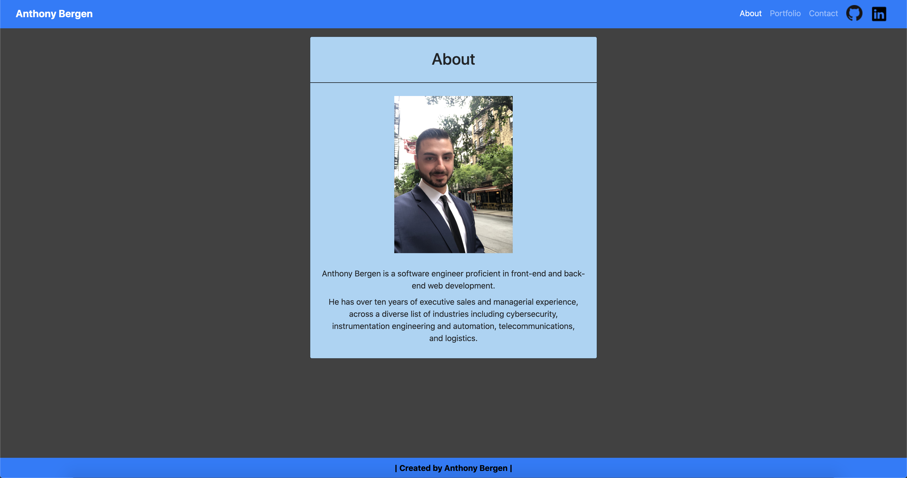

<h1 align="center">
Responsive Portfolio
</h1>
<h4 align="center" style="margin-bottom:10px">Be sure to star my configuration repo so you can keep up to date on any daily progress!</h4>

  <h4>
    </a>
    
    
        
</h4>
 

This is a responsive portfolio application

  <h4>
    <a href="https://github.com/adbergen/responsive-portfolio">
      Github Repository
    </a>
 | 
<a href="https://adbergen.github.io/responsive-portfolio/">
      Github Pages
    </a>
  </h4>

## Table of Contents

- [Installation](#installation)
- [Usage](#usage)
- [Technologies](#technologies)
- [Contributing](#contributing)

## Installation

- Open the index.html file in your web browser

## Usage

- This is a portfolio application

## Technologies

<ul>
<li>HTML</li>
<li>CSS</li>
<li>Bootstrap</li>
<li>GitHub</li>
</ul>

## Contributing

- Pull requests are welcome. For major changes, please open an issue first to discuss what you would like to change.

- Contributors: Anthony Bergen

